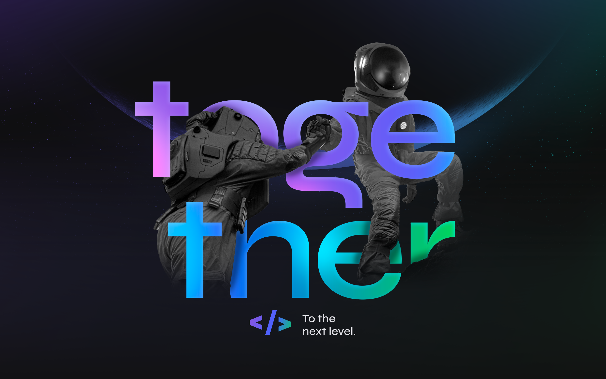

# Valorize

[![Contributors][contributors-shield]][contributors-url]
[![Forks][forks-shield]][forks-url]
[![Stargazers][stars-shield]][stars-url]
[![Issues][issues-shield]][issues-url]
[![MIT License][license-shield]][license-url]
[![LinkedIn][linkedin-shield]][linkedin-url]

<!-- PROJECT LOGO -->
<br />
<p align="center">
  <a href="https://github.com/lsglucas/valorize">
    
  </a>

  <h3 align="center">Valorize</h3>

  <p align="center">
    Valorize Next Level Week 06 Project
    <br />
    <br />
    <!-- <a href="https://github.com/lsglucas/valorize">View Demo</a> -->
    <!-- · -->
    <a href="https://github.com/lsglucas/valorize/issues">Report Bug</a>
    ·
    <a href="https://github.com/lsglucas/valorize/issues">Request Feature</a>
  </p>

  <p align="center">
  Check the official repo at <a href="https://github.com/rocketseat-education/nlw-06-nodejs">github.com/rocketseat-education/nlw-06-nodejs</a>
  </p>
</p>

<!-- TABLE OF CONTENTS -->
<details open="open">
  <summary><h2 style="display: inline-block">Table of Contents</h2></summary>
  <ol>
    <li>
      <a href="#about-the-project">About The Project</a>
      <ul>
        <li><a href="#built-with">Built With</a></li>
      </ul>
    </li>
    <li>
      <a href="#getting-started">Getting Started</a>
      <ul>
        <li><a href="#prerequisites">Prerequisites</a></li>
        <li><a href="#installation">Installation</a></li>
      </ul>
    </li>
    <li><a href="#usage">Usage</a></li>
    <li><a href="#roadmap">Roadmap</a></li>
    <li><a href="#contributing">Contributing</a></li>
    <li><a href="#license">License</a></li>
    <li><a href="#contact">Contact</a></li>
    <li><a href="#Acknowledgements">Acknowledgements</a></li>
  </ol>
</details>

<!-- ABOUT THE PROJECT -->
## 📑 About The Project

This project was develop during [_NLW 06_](#about-nlw). It's main objective was to create a simple but complete back-end api while learning about NodeJS, and related [technologies](#built-with). Valorize makes it possible for you to recognize and appreciate your colleagues ♥ through an JWT token authentication, type of compliment using tags, and finally you can send a compliment with a tag and message to another registered user.  
Apart from all of that features I have added Sentry for capture and report errors, and the Swagger UI for easier tests and endpoints documentation.

### About NLW

[_NLW_](nextlevelweek.com) is a brazilian event created by [Rocket Seat](https://rocketseat.com.br) in which you can learn a lot and deep dive into your chosen topic, and everything for free!
I recommend this event for anyone that speaks Portuguese and want to learn tech, read more in [nextlevelweek.com](nextlevelweek.com).

### Built With

<s>Yes I did copy this from the package.json</s>

* [TypeScript](https://www.typescriptlang.org)
* [NodeJS](https://nodejs.org/en/)
* [Express](https://expressjs.com)
* [TypeORM](https://typeorm.io/#/)
* [Sentry](https://sentry.io)
* [Swagger UI](https://github.com/scottie1984/swagger-ui-express#readme)
* [SQLite3](htthttps://www.sqlite.org/index.html)
* [bcryptjs](https://github.com/dcodeIO/bcrypt.js#readme)
* [jsonwebtoken](https://github.com/auth0/node-jsonwebtoken#readme)

<!-- GETTING STARTED -->
## 💻 Getting Started

To get a local copy up and running follow these simple steps.

### Prerequisites

This is an example of how to list things you need to use the software and how to install them.

* yarn

  ```sh
  npm install --global yarn
  ```

### Installation

1. Clone the repo

   ```sh
   git clone https://github.com/lsglucas/valorize.git
   cd valorize
   ```

2. Install NPM packages

   ```sh
   yarn install
   ```

3. Run development server

   ```sh
   yarn dev
   ```

<!-- USAGE EXAMPLES -->
## 📱 Usage

After running the development server you just need to open the Swagger UI, every possible _(in progress)_ request and required params, etc are documented there.  
Once the server is online you just need to open [localhost:3000/docs/](localhost:3000/docs/) and there will have the available routes and you can test it as well.

<!-- ROADMAP -->
## 🛣 Roadmap

See the [open issues](https://github.com/lsglucas/valorize/issues) for a list of proposed features (and known issues).

<!-- CONTRIBUTING -->
## 👋🏻 Contributing

Contributions are what make the open source community such an amazing place to be learn, inspire, and create. Any contributions you make are **greatly appreciated**.

1. Fork the Project
2. Create your Feature Branch (`git checkout -b feature/AmazingFeature`)
3. Commit your Changes (`git commit -m 'Add some AmazingFeature'`)
4. Push to the Branch (`git push origin feature/AmazingFeature`)
5. Open a Pull Request

<!-- LICENSE -->
## 📜 License

Distributed under the MIT License. See `LICENSE` for more information.

<!-- CONTACT -->
## 👨🏻‍💻 Contact

Lucas Garcia - [@lsglucass](https://twitter.com/lsglucass) - lsglucas@pm.me

Project Link: [https://github.com/lsglucas/valorize](https://github.com/lsglucas/valorize)

<!-- ACKNOWLEDGEMENTS -->
## 💗 Acknowledgements

I would like to thank everyone at Rocket Seat team for this amazing event, It's crazy the amount of knowledge you can obtain in less than a week of learning with this amazing team, I really appreciate you guys for doing this event and helping so many brazilians developers, and people that want to get into tech industry, special thanks to [Daniele](https://github.com/danileao), [Elias Gabriel](https://github.com/EliasGcf) and everyone at Rocket Seat! We barely finished, and I'm already looking forward for the next event!!  

Official repo at [github.com/rocketseat-education/nlw-06-nodejs](https://github.com/rocketseat-education/nlw-06-nodejs)

<!-- MARKDOWN LINKS & IMAGES -->
<!-- https://www.markdownguide.org/basic-syntax/#reference-style-links -->
[contributors-shield]: https://img.shields.io/github/contributors/lsglucas/valorize.svg?style=for-the-badge
[contributors-url]: https://github.com/lsglucas/valorize/graphs/contributors
[forks-shield]: https://img.shields.io/github/forks/lsglucas/valorize.svg?style=for-the-badge
[forks-url]: https://github.com/lsglucas/valorize/network/members
[stars-shield]: https://img.shields.io/github/stars/lsglucas/valorize.svg?style=for-the-badge
[stars-url]: https://github.com/lsglucas/valorize/stargazers
[issues-shield]: https://img.shields.io/github/issues/lsglucas/valorize.svg?style=for-the-badge
[issues-url]: https://github.com/lsglucas/valorize/issues
[license-shield]: https://img.shields.io/github/license/lsglucas/valorize.svg?style=for-the-badge
[license-url]: https://github.com/lsglucas/valorize/blob/master/LICENSE.txt
[linkedin-shield]: https://img.shields.io/badge/-LinkedIn-black.svg?style=for-the-badge&logo=linkedin&colorB=555
[linkedin-url]: https://linkedin.com/in/lsglucas
